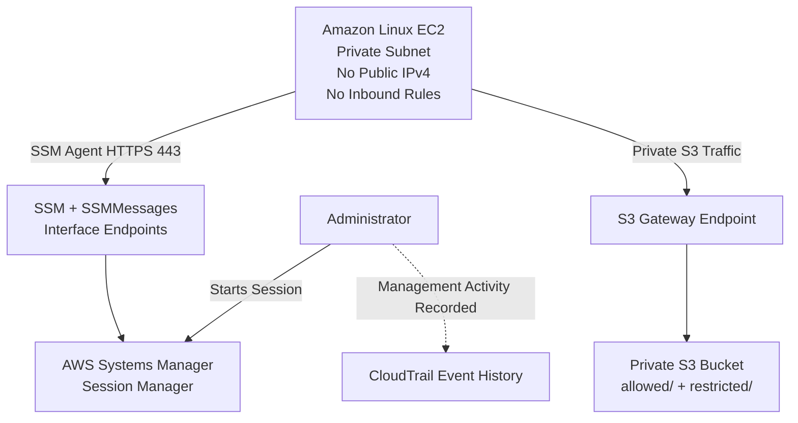

<div align="center">

# BLACKSITE

### Private AWS Security Environment

A security-focused AWS lab built around **private administration, least-privilege IAM, private service connectivity, and access-control validation**.

**AWS VPC • EC2 • IAM • S3 • Systems Manager • CloudTrail**

</div>

---

## Overview

BLACKSITE is a private AWS environment designed to minimize unnecessary public exposure while preserving secure administrative access.

The Amazon Linux EC2 workload was deployed with:

- **No public IPv4 address**
- **No inbound security-group rules**
- **No Internet Gateway**
- **No NAT Gateway**
- **No SSH key pair**

Instead of exposing SSH, the instance is administered through **AWS Systems Manager Session Manager**.

The EC2 Systems Manager agent initiates outbound HTTPS connections through private VPC interface endpoints, allowing administrative access without opening an inbound management port.

Amazon S3 access is provided through an **S3 gateway endpoint**, while AWS permissions are delivered through an **EC2 IAM instance role** rather than stored access keys.

---

## Architecture



The EC2 workload remains privately addressed while still supporting administration and AWS service access through private connectivity.

For the full network, IAM, and control-flow design, see [Architecture](docs/architecture.md).

---

## Security Controls

| Control | Implementation |
|---|---|
| Public exposure | EC2 has no public IPv4 address |
| Administrative access | AWS Systems Manager Session Manager |
| Inbound access | EC2 security group contains zero inbound rules |
| Internet routing | No Internet Gateway or NAT Gateway |
| SSH exposure | No SSH key pair or inbound TCP/22 |
| AWS credentials | Temporary credentials through an EC2 IAM role |
| S3 authorization | IAM restricted to the `allowed/` prefix |
| Private S3 connectivity | S3 gateway VPC endpoint |
| Private administration | SSM and SSMMessages interface endpoints |
| Audit visibility | AWS CloudTrail Event History |
| Metadata security | IMDSv2 required |

---

## Least-Privilege IAM

The EC2 workload operated under:

```text
BlacksiteEC2Role
```

with a custom policy:

```text
BlacksiteS3ScopedAccess
```

The workload was authorized to access:

```text
allowed/
```

but not:

```text
restricted/
```

The policy allowed only the required S3 operations within the authorized scope.

### Authorized

```text
List allowed/
Read allowed/*
Write allowed/*
```

### Denied

```text
Read restricted/*
List restricted/
Delete objects
Access unrelated S3 resources
```

---

## Access-Control Validation

The IAM boundary was tested using both positive and negative AWS CLI requests.

| Test | Result |
|---|---|
| List `allowed/` | ✅ PASS |
| Download from `allowed/` | ✅ PASS |
| Upload to `allowed/` | ✅ PASS |
| Read `restricted/` | ✅ DENIED |
| List `restricted/` | ✅ DENIED |

Restricted operations returned:

```text
403 Forbidden
```

and:

```text
AccessDenied
```

confirming that the EC2 role could not access resources outside its intended scope.

---

## Automated Validation

A Bash script reproduces the primary authorization tests:

```text
[PASS] Authorized prefix accessible
[PASS] Authorized object download succeeded
[PASS] Authorized object upload succeeded
[PASS] Restricted object access denied
```

Source:

[`scripts/validate-access.sh`](scripts/validate-access.sh)

---

## Audit Validation

AWS CloudTrail Event History was used to inspect management activity performed against the environment.

A controlled EC2:

```text
CreateTags
```

operation was generated and located in CloudTrail.

The event record exposed information including:

```text
userIdentity
eventTime
eventSource
eventName
sourceIPAddress
requestParameters
resources
```

This demonstrated that administrative AWS activity could be traced by identity, API action, timestamp, and affected resource.

---

## Evidence

| Validation | Evidence |
|---|---|
| EC2 deployed without a public IP | [`01-private-ec2-no-public-ip.png`](evidence/01-private-ec2-no-public-ip.png) |
| No inbound EC2 rules | [`02-no-inbound-rules.png`](evidence/02-no-inbound-rules.png) |
| Private route table | [`03-private-route-table.png`](evidence/03-private-route-table.png) |
| Session Manager administration | [`04-session-manager.png`](evidence/04-session-manager.png) |
| Authorized S3 read | [`05-authorized-read.png`](evidence/05-authorized-read.png) |
| Authorized S3 write | [`06-authorized-write.png`](evidence/06-authorized-write.png) |
| Restricted access denied | [`07-restricted-access-denied.png`](evidence/07-restricted-access-denied.png) |
| Automated validation | [`08-validation-script.png`](evidence/08-validation-script.png) |
| CloudTrail audit event | [`09-cloudtrail-event.png`](evidence/09-cloudtrail-event.png) |

---

## Repository Structure

```text
blacksite-private-aws/
├── README.md
├── docs/
│   ├── architecture.md
│   ├── threat-model.md
│   ├── test-plan.md
│   ├── validation-results.md
│   └── cleanup.md
├── evidence/
│   ├── 01-private-ec2-no-public-ip.png
│   ├── 02-no-inbound-rules.png
│   ├── 03-private-route-table.png
│   ├── 04-session-manager.png
│   ├── 05-authorized-read.png
│   ├── 06-authorized-write.png
│   ├── 07-restricted-access-denied.png
│   ├── 08-validation-script.png
│   └── 09-cloudtrail-event.png
├── policies/
│   └── ec2-s3-access.json
└── scripts/
    └── validate-access.sh
```

---

## Threat Model

BLACKSITE was designed around several specific risks.

**Public administrative exposure**  
The workload has no public IPv4 address or exposed inbound administrative service. Administration occurs through Systems Manager.

**Long-lived AWS credentials**  
The workload uses temporary credentials supplied through an EC2 IAM role instead of stored access keys.

**Excessive storage permissions**  
The IAM role is restricted to the required S3 prefix, with negative authorization tests confirming access outside that scope is denied.

**Public object exposure**  
S3 Block Public Access remains enabled.

**Unnecessary internet connectivity**  
The workload has no Internet Gateway or NAT Gateway route and instead uses private AWS service endpoints.

**Untracked infrastructure changes**  
CloudTrail Event History provides visibility into AWS management activity.

See the full [Threat Model](docs/threat-model.md).

---

## Documentation

- [Architecture](docs/architecture.md)
- [Threat Model](docs/threat-model.md)
- [Validation Plan](docs/test-plan.md)
- [Validation Results](docs/validation-results.md)
- [Cleanup Runbook](docs/cleanup.md)
- [IAM Policy](policies/ec2-s3-access.json)
- [Validation Script](scripts/validate-access.sh)

---

## Limitations

BLACKSITE is a controlled security lab rather than a production deployment.

Current limitations include:

- Single AWS Region
- Single Availability Zone
- Single EC2 workload
- Manually provisioned infrastructure
- No centralized SIEM
- No automated remediation
- No production or sensitive data

---

## Future Improvements

Potential extensions include:

- Terraform-based infrastructure provisioning
- Additional IAM authorization scenarios
- Automated configuration-drift detection
- Security event alerting
- Infrastructure-as-code validation
- Multi-environment architecture

---

## Cleanup

The live AWS infrastructure was intentionally removed after validation to avoid leaving unnecessary cloud resources provisioned.

The repository preserves the architecture, IAM policy, automation, validation results, and supporting evidence.

See the [Cleanup Runbook](docs/cleanup.md) for the teardown procedure.
