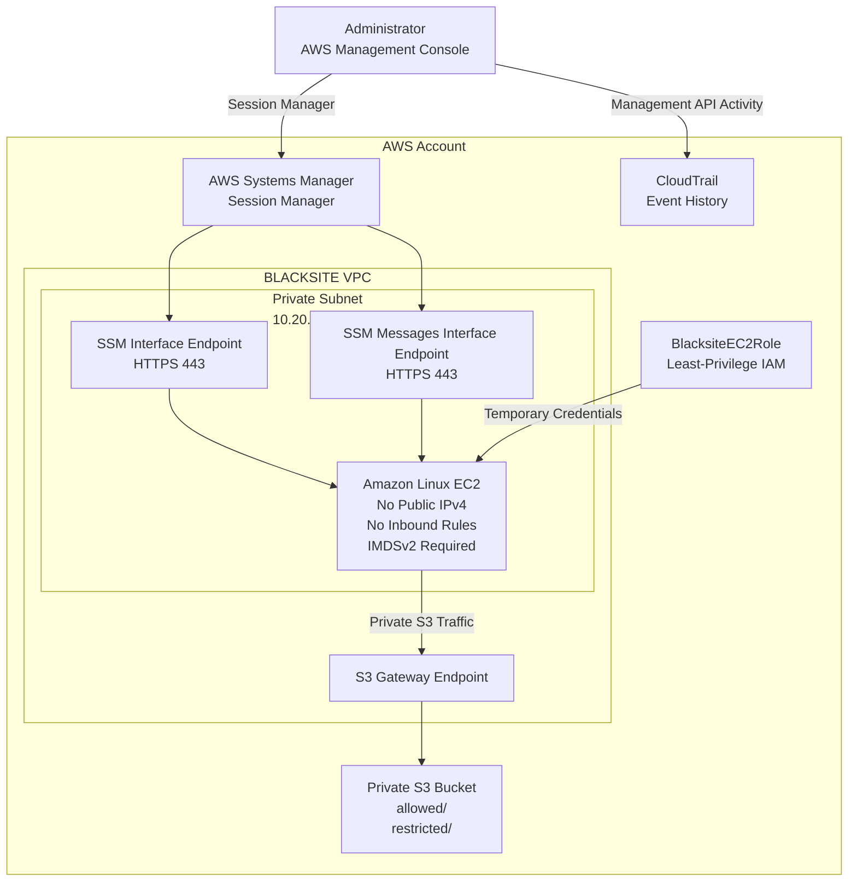
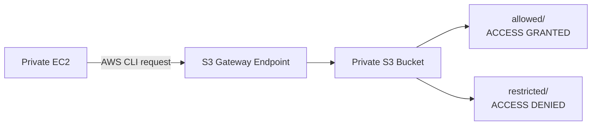

<div align="center">

# BLACKSITE Architecture

### Private AWS Administration Without Public Network Exposure

**VPC • EC2 • IAM • S3 • Systems Manager • PrivateLink • CloudTrail**

</div>

---

## Architecture Overview

BLACKSITE was designed around one primary constraint:

> **The EC2 workload should remain privately addressed and directly unreachable from the public internet while still supporting secure administration, scoped AWS service access, and audit visibility.**

The environment therefore avoids a public IPv4 address, Internet Gateway, NAT Gateway, SSH key pair, and inbound administrative ports.

Instead, administration and service access occur through AWS-managed private connectivity.

---

## Network Architecture



---

## Network Boundary

The BLACKSITE workload was deployed inside:

| Component | Configuration |
|---|---|
| VPC | `10.20.0.0/16` |
| Private subnet | `10.20.1.0/24` |
| Public IPv4 | None |
| Internet Gateway | None |
| NAT Gateway | None |
| SSH key pair | None |
| EC2 inbound rules | None |

The subnet route table contained only local VPC routing and the AWS-managed prefix-list route required by the S3 gateway endpoint.

There was no `0.0.0.0/0` route to an Internet Gateway or NAT Gateway.

---

## Administrative Access

Traditional SSH administration was intentionally avoided.

Instead, the EC2 instance was managed using **AWS Systems Manager Session Manager**.

Private interface endpoints provided connectivity to:

```text
com.amazonaws.<region>.ssm
com.amazonaws.<region>.ssmmessages
```

The endpoint security group allowed HTTPS on TCP port `443` from the EC2 workload security group.

The EC2 security group itself contained **zero inbound rules**.

This allowed administrative sessions without exposing port `22` or assigning the instance a public address.

---

## Identity and Access

The EC2 workload used:

```text
BlacksiteEC2Role
```

rather than static AWS access keys.

The role supplied temporary AWS credentials to the instance and included:

```text
AmazonSSMManagedInstanceCore
BlacksiteS3ScopedAccess
```

The custom S3 policy restricted the workload to:

```text
allowed/
```

### Authorized

```text
List allowed/
GetObject allowed/*
PutObject allowed/*
```

### Not Authorized

```text
Read restricted/*
List restricted/
Delete objects
Access unrelated S3 resources
```

The authorization boundary was tested directly rather than assumed from the policy configuration.

---

## Private S3 Connectivity

The EC2 workload accessed Amazon S3 through an **S3 Gateway VPC Endpoint**.



This allowed the instance to communicate with S3 without requiring a public internet route.

---

## Access-Control Validation

The deployed environment was tested using both positive and negative authorization scenarios.

| Scenario | Expected | Observed |
|---|---:|---:|
| List `allowed/` | Allow | ✅ PASS |
| Download `allowed/mission-brief.txt` | Allow | ✅ PASS |
| Upload object to `allowed/` | Allow | ✅ PASS |
| Download `restricted/admin-only.txt` | Deny | ✅ PASS |
| List `restricted/` | Deny | ✅ PASS |

The restricted read returned:

```text
403 Forbidden
```

and the restricted prefix listing returned:

```text
AccessDenied
```

confirming that the instance role could not access resources outside its authorized scope.

---

## Audit Visibility

AWS CloudTrail Event History was used to inspect administrative activity within the environment.

A controlled EC2 `CreateTags` operation was generated and traced through CloudTrail.

The event record exposed information including:

```text
userIdentity
eventTime
eventSource
eventName
sourceIPAddress
requestParameters
resources
```

This provided visibility into:

- **Who** initiated an action
- **What** API operation occurred
- **When** it occurred
- **Which resource** was affected

---

## Security Design Summary

| Risk | BLACKSITE Control |
|---|---|
| Public administrative exposure | No public IP and no inbound EC2 rules |
| Exposed SSH service | Systems Manager replaces SSH |
| Long-lived AWS credentials | EC2 IAM role provides temporary credentials |
| Excessive S3 permissions | Prefix-scoped IAM policy |
| Unauthorized storage access | Positive and negative authorization testing |
| Public S3 exposure | S3 Block Public Access |
| Internet dependency | Private AWS service endpoints |
| Untracked infrastructure changes | CloudTrail Event History |
| Weak metadata access | IMDSv2 required |

---

## Data and Control Flow

```text
Administrator
      |
      | Session Manager
      v
Systems Manager
      |
      | Private interface endpoints
      v
Private EC2 Instance
      |
      | Temporary IAM role credentials
      |
      | S3 gateway endpoint
      v
Private S3 Bucket
      |
      +---- allowed/       GRANTED
      |
      +---- restricted/    DENIED
```

Administrative AWS API activity is independently visible through CloudTrail Event History.

---

## Design Decisions

### Why no public IPv4 address?

The workload did not require direct inbound internet connectivity. Removing the public address reduced unnecessary exposure.

### Why no SSH?

Session Manager provided administrative shell access without opening port `22` or managing SSH keys.

### Why use an IAM role?

An EC2 IAM role provides temporary credentials automatically and avoids storing long-lived AWS access keys on the host.

### Why use an S3 gateway endpoint?

The gateway endpoint allowed S3 access from the private subnet without requiring an Internet Gateway or NAT Gateway.

### Why perform denied-access tests?

A policy that looks correct is not the same as a policy that has been validated. Negative tests confirmed that the intended authorization boundary was actually enforced.

---

## Evidence

Supporting validation artifacts are available in the [`evidence/`](../evidence/) directory.

Key evidence includes:

- [No public EC2 address](../evidence/01-private-ec2-no-public-ip.png)
- [No inbound EC2 rules](../evidence/02-no-inbound-rules.png)
- [Private route table](../evidence/03-private-route-table.png)
- [Session Manager access](../evidence/04-session-manager.png)
- [Authorized S3 read](../evidence/05-authorized-read.png)
- [Authorized S3 write](../evidence/06-authorized-write.png)
- [Restricted access denied](../evidence/07-restricted-access-denied.png)
- [Automated validation](../evidence/08-validation-script.png)
- [CloudTrail audit event](../evidence/09-cloudtrail-event.png)

---

## Limitations

BLACKSITE is a controlled security lab rather than a production architecture.

The implementation currently uses:

- One AWS Region
- One Availability Zone
- One EC2 workload
- Manual infrastructure provisioning
- No centralized SIEM
- No automated remediation
- No production or sensitive data

The live AWS infrastructure was intentionally removed after validation. The repository preserves the architecture, policies, automation, test results, and evidence.
